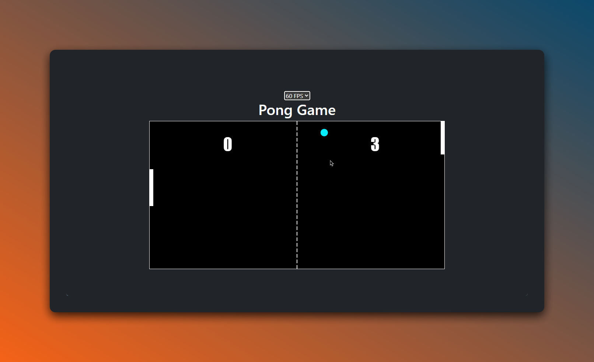

# 🎾 Pong Game



[](https://github.com/EXELVI/Pong_game/stargazers)
[](https://github.com/EXELVI/Pong_game)
[](https://github.com/EXELVI/Pong_game/issues)
[](https://github.com/EXELVI/Pong_game/commits/main)

Pong game is a simple game made in HTML, CSS and JavaScript. It is a two-player game where the players control the paddles with the keyboard with an AI opponent.

## 🚀 Getting Started

How to run the game on your local machine.
 
1. Clone the repository
    ```bash
    git clone https://github.com/EXELVI/Pong_game.git
    ```

2. Open the `index.html` file in your preferred browser.

3. Play the game.

## 🎮 How to Play 

Use the `W` and `S` or `Up` and `Down` keys to move the left paddle up and down.


## ✨ Features

- Two-player game
- AI opponent
- Scoreboard
- Change game speed by changing the FPS with the select input

## 🤝 Contributing

Contributions are welcome! Feel free to open an issue or submit a pull request if you have any improvements to the game.
